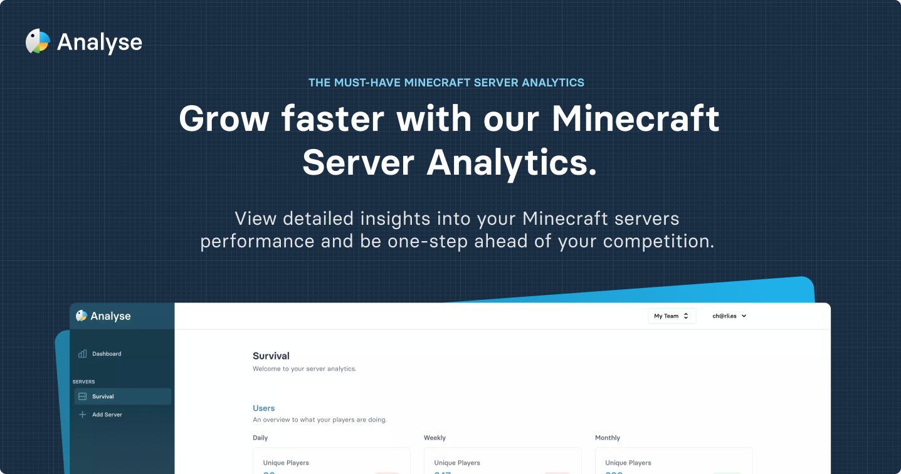

# Analyse (Spigot Plugin)

This is the official spigot adapter for Analyse - the Minecraft Server Analytics platform that tracks community performance.

## Installation
1. Download this plugin (Latest from Releases).
2. Head to Analyse Dashboard, and copy the server command.
3. Start your server, and run the setup command.

You're ready to go!

## API Requests
Below we have documented the api requests that this plugin performs, we allow for any custom server implementations to be written. We have listed the endpoints and required payloads for this below.

Base URL: `https://app.analyse.net/api/v1/`

_All requests require the `X-SERVER-TOKEN` header with the token provided._

**Server Information**
 - URL: `server`
 - Type: `GET`

---

**Player Sessions**

 - URL: `server/sessions`
 - Type: `POST`

_Example Payload_

```json
{
  "name": "User",
  "uuid": "3234-2324-3232-32323",
  "joined_at": "2021-12-29 16:58:24.436228",
  "quit_at": "2021-12-29 19:58:24.436228",
  "ip_address": "017386cd32f983e735db582718f11ffbc9b1233b06f16383f13f6d23823da0e3",
  "country": "GB",
  "stats": [
    {
      "key": "player_kills",
      "value": "100"
    }
  ]
}
```

---

**Server Heartbeat**

URL: `server/heartbeat`

Type: `POST`

_Example Payload_
```json
{
  "players": 300
}
```

---

## Compiling
1. Clone this repo (`git clone git@github.com:track/plugin.git`).
2. Make any needed changes.
3. Then use `./gradlew shadowjar` to build.